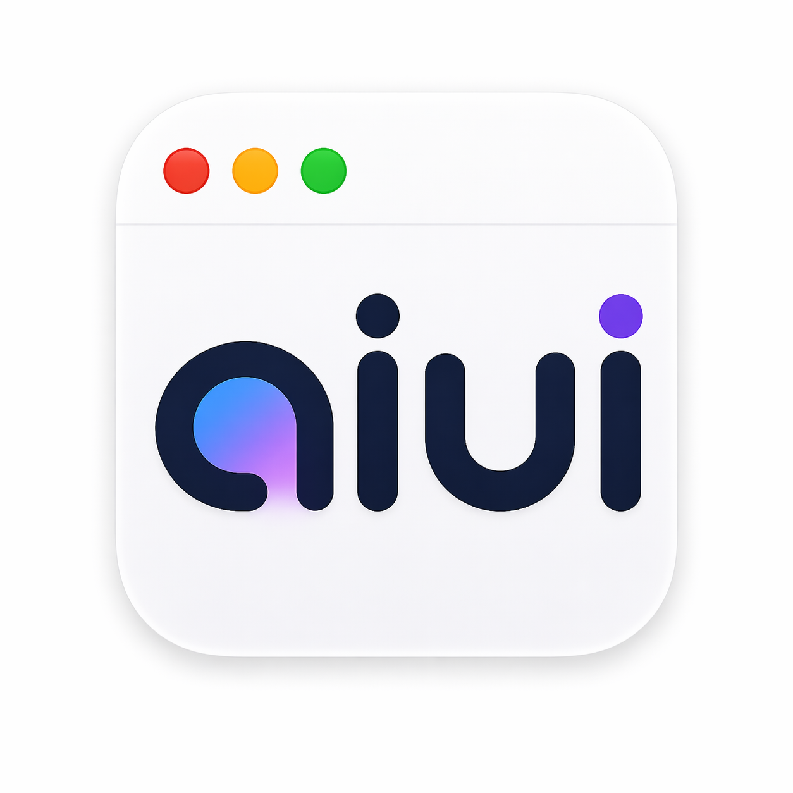
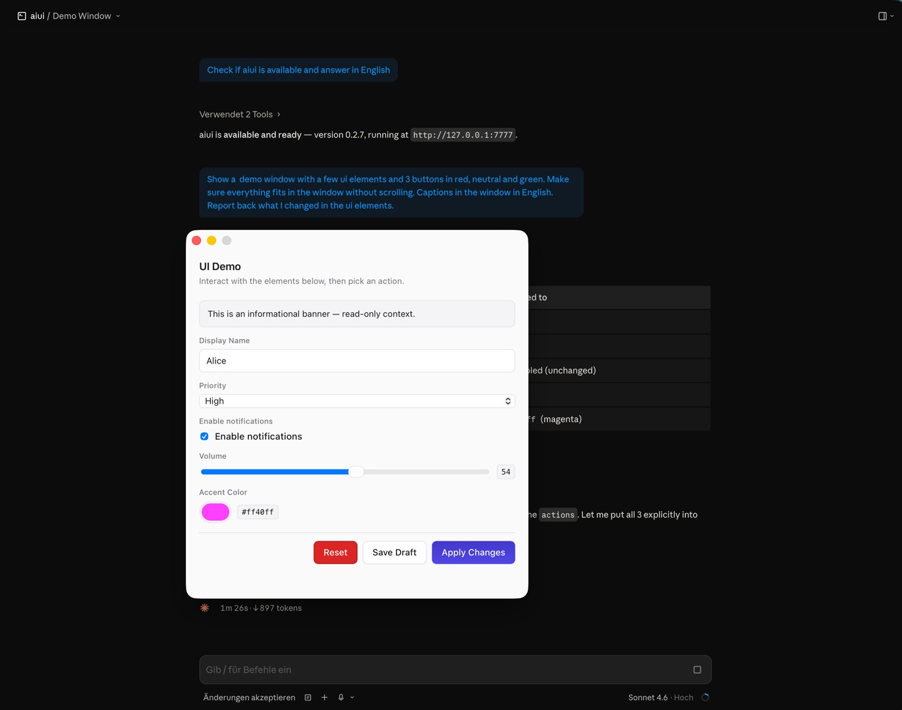

<table>
<tr>
<td width="140" valign="middle">

</td>
<td valign="middle">

# aiui

**Claude Code can ask, confirm, and collect input — as real native macOS dialogs.**

</td>
</tr>
</table>

---

## The chat is sometimes the wrong place

When Claude Code has a question that's really a pick between options, you
have to type the answer in prose. When it wants your go-ahead before
touching production, you get a blue Yes/No box — and nothing more
tailored. Need to hand it a secret for a moment? It lands in the
transcript.

There's a better way.

**aiui** lets Claude Code open real, native dialogs on your Mac:

- **"Which of these three deploy strategies?"** A window with three
  cards, each with context. One click. Done.
- **"Shall I drop the production `orders` table?"** A red destructive
  button with a clear warning. One click.
- **"Fill in name, role, start date."** A clean form instead of a
  typing-heavy chat exchange.
- **"Rank these five tickets in the order you want them."** Drag to
  reorder, the order comes back as a clean list.

The agent gets your answer as structured data and keeps going. No side
conversations, no throwaway web dashboards cluttering your system — just
a familiar macOS window that does what it looks like.

  

## Works locally and remotely

Running Claude Code directly on your Mac? aiui plugs in.

Running it over SSH on a remote machine (dev box, project VM)? aiui
automatically sets up a tunnel so the remote agent can pop dialogs right
on your Mac. Register the host once in settings; from then on it just
works.

## Install

No Terminal. No Homebrew. No Python. No `uv`.

1. **[Download aiui.app](https://github.com/byte5ai/aiui/releases/latest)**
   (DMG, Apple Silicon).
2. Drag into `Applications`.
3. Launch it once from Finder.

That's it. aiui registers itself with Claude Desktop and Claude Code
automatically. The MCP server ships inside the app bundle as native
code, so you don't need a Python toolchain on your Mac.

From now on aiui runs silently in the background — only while Claude
Desktop is open. No dock icon, no menu-bar clutter, no lingering
daemons. aiui tools are available in **every** Claude Code session
immediately; no per-project config needed.

Try it straight away in any Claude Code session: *"Ask me with aiui
which of three deploy strategies we want today."* The agent opens an
options dialog, you click, it keeps going.

Future updates: use `/aiui:update` in Claude Code, or wait for the
auto-check the next time aiui's settings window opens.

## What you get

| What annoys you today | With aiui |
|---|---|
| Typing answers that are really single clicks | A real macOS dialog |
| Destructive actions with a vague "please confirm" | Red-styled yes/no, unambiguous |
| Ad-hoc local web UIs for one-off tasks | No longer needed |
| Remote hosts where the agent has no way to ask you | Dialogs tunnel back to your Mac automatically |

## Privacy

aiui runs purely locally on your Mac. No telemetry, no usage data, no
content leaves your system. A local auth token lives in `~/.config/aiui/`
(mode 0600) and is only scp'd to hosts you explicitly register in
settings.

## Slash commands in Claude Code

| Command | What it does |
|---|---|
| `/aiui:teach` | Briefs the agent on aiui — loads the full widget catalog and design rules into the session. Run once per project. |
| `/aiui:update` | Agent calls the `update` tool; aiui checks the release feed, silently installs any available update, and reports the version delta back. Responds before the background relaunch, so the agent always gets the answer. |
| `/aiui:version` | Reports the currently installed aiui version in one line. |

## For agents: the skill

To keep agents from producing generic "UI slop", aiui installs a
skill document into Claude Code's skill directory on startup. It
carries the rules: which widget for which job, how labels should read,
what anti-patterns to avoid. Every remote you register gets the skill
installed too.

Full catalog: [`docs/skill.md`](docs/skill.md).

## FAQ

**Is it safe?** aiui is open source (MIT), builds reproducibly, is Apple
Developer-ID signed and notarized. It never phones home. The auth token
stays under `~/.config/aiui/` on your machine and is only copied to
hosts you explicitly register in settings.

**Do I need `uv` or Python?** No. Since v0.3.0 the MCP server ships
inside the aiui.app bundle as native Rust code — drag-and-drop install
with no outside dependencies.

For the special case of a remote SSH host that doesn't have aiui.app
locally, the standalone Python package `aiui-mcp` is still on PyPI and
gets used via `uvx aiui-mcp`. aiui registers that automatically when you
add the remote in settings.

**How much memory does it use?** The companion idles around 30–50 MB.
The underlying WebKit view loads only while a dialog is on screen.

**Does it work on Intel Macs?** Not in v0.2.x — Apple Silicon
(arm64) only. Intel support is on the roadmap.

**Does it work on Linux or Windows?** No. aiui renders native macOS
dialogs; porting would require a different companion per OS. If you want
this, please [open an issue](https://github.com/byte5ai/aiui/issues/new)
and vote.

**Can I use aiui without Claude Desktop?** The companion is
auto-spawned by Claude Desktop via its MCP registration, so in the
default setup, no. You can launch `aiui.app` manually though — as long
as `localhost:7777` is reachable, any MCP client can render dialogs.

**Why not just use Claude Desktop's built-in AskUserQuestion?** It's
great for single yes/no or single-choice questions, but doesn't cover
multi-field forms, sortable lists, colour pickers, date ranges, or
hierarchical pickers. aiui complements it.

**Does aiui work in other MCP-capable clients?** The `aiui-mcp` server
is a standard MCP server, so technically yes. The companion is Claude
Desktop-specific in how it auto-installs, but the HTTP protocol on
`localhost:7777` is client-agnostic.

## Known limitations

- **Apple Silicon only** (M1 and later). Intel Macs are not supported
  in v0.2.x.
- **macOS 11 (Big Sur) or later.**
- **One Mac per companion.** If you want dialogs on multiple Macs
  simultaneously, each needs its own aiui install; tokens and tunnels
  are per-Mac.
- **Password fields** mask input while typing but return the value as
  plaintext to the agent — see the [widget catalog](docs/skill.md#password-fields)
  for guidance.
- **No headless rendering.** aiui needs an active macOS GUI session;
  it won't render dialogs on a server-style headless install.

## Troubleshooting

| Symptom | What to do |
|---|---|
| No dialog appears | Open `/Applications/aiui.app` and check the status dot. The remote must show "connected". |
| "aiui companion not reachable" in chat | Claude Desktop isn't running, or the Mac is asleep. |
| "token rejected (401)" | An old aiui process is holding the port on the remote. `pkill -f aiui` on the remote, then "Remove" and "Add" that remote again in aiui settings. |

Bugs or feature requests → [open an issue](https://github.com/byte5ai/aiui/issues/new).
The "Report issue" button in settings pre-fills version and build SHA.

## Open source

aiui is MIT-licensed, hosted at [byte5ai/aiui](https://github.com/byte5ai/aiui).
Pull requests and issues are welcome — see [CONTRIBUTING.md](CONTRIBUTING.md)
for the build layout and design principles.

Python server package: [`aiui-mcp`](https://pypi.org/project/aiui-mcp/)
on PyPI.
