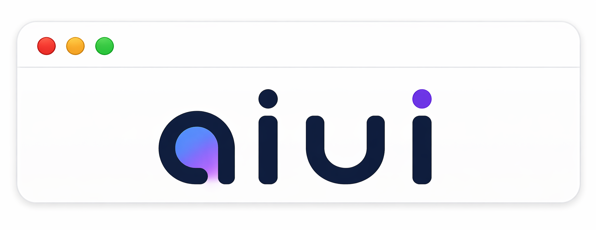
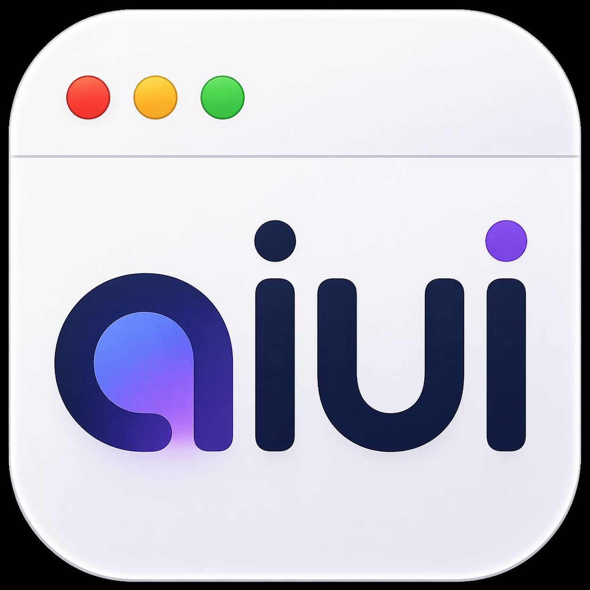

  

  <strong>Claude Code can ask, confirm, and collect input — as real native macOS dialogs.</strong>

  
  

---

## The chat is sometimes the wrong place

When Claude Code has a question that's really a pick between options, you
have to type the answer in prose. When it wants your go-ahead before
touching production, you get a blue Yes/No box — and nothing more
tailored. Need to hand it a secret for a moment? It lands in the
transcript.

There's a better way.

**aiui** lets Claude Code open real, native dialogs on your Mac:

- **"Which of these three deploy strategies?"** A window with three
  cards, each with context. One click. Done.
- **"Shall I drop the production `orders` table?"** A red destructive
  button with a clear warning. One click.
- **"Fill in name, role, start date."** A clean form instead of a
  typing-heavy chat exchange.
- **"Rank these five tickets in the order you want them."** Drag to
  reorder, the order comes back as a clean list.

The agent gets your answer as structured data and keeps going. No side
conversations, no throwaway web dashboards cluttering your system — just
a familiar macOS window that does what it looks like.

  

## Works locally and remotely

Running Claude Code directly on your Mac? aiui plugs in.

Running it over SSH on a remote machine (dev box, project VM)? aiui
automatically sets up a tunnel so the remote agent can pop dialogs right
on your Mac. Register the host once in settings; from then on it just
works.

## Install in 3 minutes

1. **[Download aiui.app](https://github.com/byte5ai/aiui/releases/latest)**
   (DMG, Apple Silicon), open it, drag into `Applications`.
2. **Launch once** from Finder. aiui registers itself with Claude Desktop
   and Claude Code automatically.
3. **Restart Claude Desktop.** That's it.

From now on aiui runs silently in the background — only while Claude
Desktop is open. No dock icon, no menu-bar clutter, no lingering
daemons. aiui tools are available in **every** Claude Code session
immediately; no per-project config needed.

Try it straight away in any Claude Code session: *"Ask me with aiui
which of three deploy strategies we want today."* The agent opens an
options dialog, you click, it keeps going.

Future updates install themselves: aiui quietly prompts "update
available", one click, done.

## What you get

| What annoys you today | With aiui |
|---|---|
| Typing answers that are really single clicks | A real macOS dialog |
| Destructive actions with a vague "please confirm" | Red-styled yes/no, unambiguous |
| Ad-hoc local web UIs for one-off tasks | No longer needed |
| Remote hosts where the agent has no way to ask you | Dialogs tunnel back to your Mac automatically |

## Privacy

aiui runs purely locally on your Mac. No telemetry, no usage data, no
content leaves your system. A local auth token lives in `~/.config/aiui/`
(mode 0600) and is only scp'd to hosts you explicitly register in
settings.

## For agents: the skill

To keep agents from producing generic "UI slop", aiui installs a
skill document into Claude Code's skill directory on startup. It
carries the rules: which widget for which job, how labels should read,
what anti-patterns to avoid. Every remote you register gets the skill
installed too.

Full catalog: [`docs/skill.md`](docs/skill.md).

## Troubleshooting

| Symptom | What to do |
|---|---|
| No dialog appears | Open `/Applications/aiui.app` and check the status dot. The remote must show "connected". |
| "aiui companion not reachable" in chat | Claude Desktop isn't running, or the Mac is asleep. |
| "token rejected (401)" | An old aiui process is holding the port on the remote. `pkill -f aiui` on the remote, then "Remove" and "Add" that remote again in aiui settings. |

Bugs or feature requests → [open an issue](https://github.com/byte5ai/aiui/issues/new).
The "Report issue" button in settings pre-fills version and build SHA.

## Open source

aiui is MIT-licensed, hosted at [byte5ai/aiui](https://github.com/byte5ai/aiui).
Pull requests and issues are welcome — see [CONTRIBUTING.md](CONTRIBUTING.md)
for the build layout and design principles.

Python server package: [`aiui-mcp`](https://pypi.org/project/aiui-mcp/)
on PyPI.
